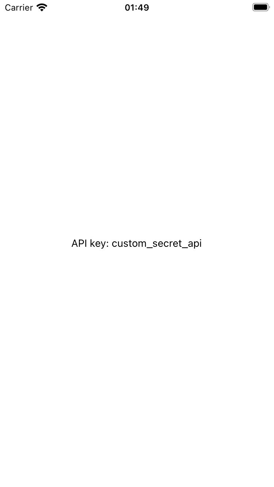

# expo-native-configuration

My new module

# Installation in bare React Native projects

For bare React Native projects, you must ensure that you have [installed and configured the `expo` package](https://docs.expo.dev/bare/installing-expo-modules/) before continuing.

### Add the package to your npm dependencies

```
npm install expo-native-configuration
```

### Configure for iOS

Run `npx pod-install` after installing the npm package.

### Configure for Android

### SCREENSHOTS

    

# Contributing

Contributions are very welcome! Please refer to guidelines described in the [contributing guide](https://github.com/expo/expo#contributing).
****